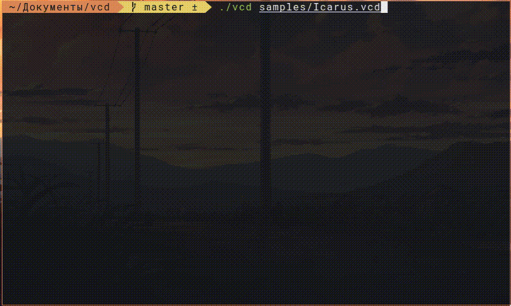

#  SimpleVCD

VCD file command line viewer. TUI remplacement to GTKWave.



## Download & Build

Linux and MacOS binaries are available in the [releases page](../../releases)

Self assembly:

```bash
gcc vcd.c -o vcd
```

## Usage

```
Usage: ./vcd [OPTION] [FILE]...:
 -h:			: this help screen
 -w=2			: width of each sample  (1,2,...)
 -r=2			: rounded wave (0:none,1:pipe,2:slash)
 -t=10			: time scale step (0:none,1,10,...)
 -b=0			: Begin sample (0:begin,1,...)
 -e=0			: End sample (0:end,1,...)
 -i=1			: tui (0:off,1:on)
 -s=a,b,c		: comma separated scope(s) to display
```

## Examples

```bash
./vcd -i=0 -w=3 -r=1 -t=10 samples/plasma.vcd > test.out
./vcd -i=1 -t=2 samples/Icarus.vcd
```

## TODO:

- [ ] fix a bug that does not allow using the entire area of the terminal
- [ ] Clean up your code

## Credits

This project is a fork of the [yne/vcd](https://github.com/yne/vcd) project based on an old version of the program.
